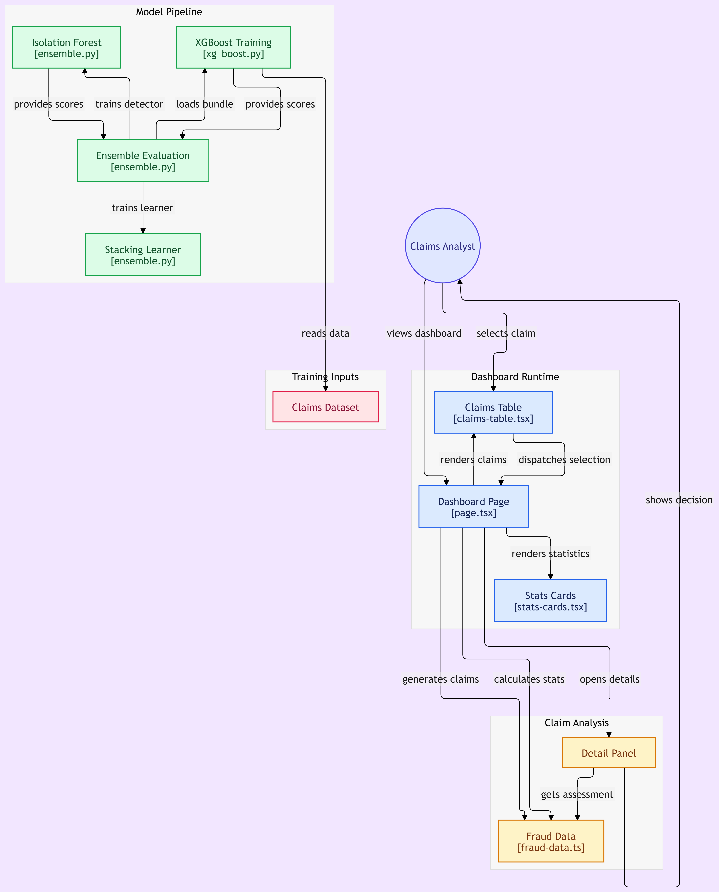

# Insurance Claims Fraud Detection
 
A hybrid machine learning system that scores insurance claims for fraud risk, paired with an analyst dashboard for reviewing flagged claims. The model combines an unsupervised anomaly detector (Isolation Forest) with a supervised classifier (XGBoost) through a stacking learner, so it can catch both known fraud patterns and unusual claims it has never seen before.
 
> **Status:** Model pipeline is complete. The dashboard currently reads from `fraud-data.ts` (sample data) and is not yet wired to a live inference API. See [Limitations & Roadmap](#limitations--roadmap).
 


---
 
## Table of Contents
 
- [Problem Statement](#problem-statement)
- [Final Results & Architecture Comparison](#final-results--architecture-comparison)
- [Why These Models?](#why-these-models)
- [Project Structure](#project-structure)
- [Getting Started](#getting-started)
- [Training the Models](#training-the-models)
- [Running the Dashboard](#running-the-dashboard)
- [Evaluation Methodology](#evaluation-methodology)
- [Limitations & Roadmap](#limitations--roadmap)
---
 
## Problem Statement
 
Insurance fraud costs the industry billions each year and is hard to detect because:
 
1. **Severe class imbalance.** Confirmed fraud is typically a small fraction of all claims.
2. **Delayed, noisy labels.** Fraud is often confirmed months after a claim is filed, and many fraudulent claims are never caught, so "non-fraud" labels contain hidden fraud.
3. **Evolving tactics.** Fraudsters adapt, so a model trained only on past fraud can miss new schemes.
4. **High cost of false positives.** Wrongly flagging honest customers hurts trust and wastes investigator time.
This project addresses these with a hybrid ensemble and a human-in-the-loop dashboard, where the model prioritizes claims for review and an analyst makes the final decision. It never denies claims automatically.
 
---
 
## Final Results & Architecture Comparison
 

 
*Figure 1: System architecture showing the model pipeline, training inputs, and the analyst dashboard.*
 
### Model Comparison
 
<!-- TODO: replace the placeholders below with your actual evaluation results -->
 
| Model | Precision | Recall | F1 | ROC-AUC | PR-AUC |
|---|---|---|---|---|---|
| Isolation Forest (unsupervised) | TODO | TODO | TODO | TODO | TODO |
| XGBoost (supervised) | TODO | TODO | TODO | TODO | TODO |
| **Stacked Ensemble (final)** | TODO | TODO | TODO | TODO | TODO |
 
**Key takeaways** *(update after filling in the table)*:
 
- The stacked ensemble outperforms either base model alone on PR-AUC, which is the most informative metric under heavy class imbalance.
- Isolation Forest alone has lower precision, but it contributes signal on claims XGBoost is unsure about.
- XGBoost provides the bulk of the predictive power when labeled fraud examples are available.
---
 
## Why These Models?
 
### 1. Isolation Forest (unsupervised anomaly detection)
 
**What it does:** Isolates observations by randomly splitting features. Anomalies are easier to isolate, so they end up with shorter paths in the trees and higher anomaly scores.
 
**Why it fits insurance fraud:**
 
- **Doesn't need labels.** Confirmed fraud labels are scarce, delayed, and incomplete. Isolation Forest learns what "normal" looks like from all claims.
- **Catches novel fraud.** Because it flags anything unusual rather than anything resembling past fraud, it can surface new schemes a supervised model has never seen.
- **Fast and scalable.** It runs in roughly linear time and handles high-dimensional tabular data well.
- **Few hyperparameters.** It is easy to tune and stable across runs.
**Weakness:** Unusual is not the same as fraudulent. Rare but legitimate claims (for example, a genuine total-loss event) also score high, which is why it isn't used alone.
 
### 2. XGBoost (supervised gradient boosting)
 
**What it does:** Builds an ensemble of shallow decision trees sequentially, with each tree correcting the errors of the previous ones.
 
**Why it fits insurance fraud:**
 
- **Strong on tabular data.** Gradient-boosted trees consistently outperform most other approaches on structured, mixed-type data like claims records.
- **Handles class imbalance.** The `scale_pos_weight` parameter and custom objectives let the model focus on the rare fraud class.
- **Captures non-linear interactions.** Fraud often hides in feature combinations (for example, a high claim amount shortly after policy inception with a specific provider), and trees model these naturally.
- **Robust to missing values and mixed feature scales**, with little preprocessing required.
- **Interpretable enough.** Feature importances and SHAP values can explain individual predictions.
**Weakness:** It can only recognize patterns present in its training labels, so it may miss new fraud tactics and is sensitive to label noise.
 
### 3. Stacking Learner (meta-model)
 
**What it does:** Takes the outputs of the base models (the Isolation Forest anomaly score and the XGBoost fraud probability) as input features and learns how best to combine them into a final fraud score.
 
**Why stacking instead of simple averaging or voting:**
 
- **The two models are complementary.** XGBoost is precise on known patterns and Isolation Forest is broad on unknown ones. A learned combiner can trust each one in the situations where it performs better.
- **Data-driven weighting.** Instead of hand-picking weights, the meta-learner discovers them from validation data.
- **Better calibrated output.** The final score is more reliable for setting review thresholds.
**Important:** The stacking learner is trained on **out-of-fold predictions** from the base models, never on predictions for data the base models were trained on. Otherwise the meta-learner sees overconfident scores and overfits.
 
### Alternatives Considered
 
| Alternative | Why it wasn't the primary choice |
|---|---|
| Logistic Regression | Too simple to capture feature interactions; kept as a possible baseline or meta-learner |
| Random Forest | Comparable to XGBoost but usually slightly weaker on imbalanced tabular data |
| Autoencoders | Powerful for anomaly detection but need more data, more tuning, and are harder to explain |
| One-Class SVM | Scales poorly to large claim volumes |
| Deep neural networks | Rarely beat gradient boosting on tabular data and are less interpretable, which matters in regulated insurance settings |
 
---
 
## Project Structure
 
<!-- TODO: adjust paths to match your actual repository layout -->
 
```
.
├── model/
│   ├── xg_boost.py        # XGBoost training
│   └── ensemble.py        # Isolation Forest, stacking learner, ensemble evaluation
├── data/
│   └── claims.csv         # Claims dataset (not committed if sensitive)
├── dashboard/
│   ├── page.tsx           # Dashboard page (state, selection, layout)
│   ├── claims-table.tsx   # Claims list with fraud scores
│   ├── stats-cards.tsx    # Summary statistics
│   └── fraud-data.ts      # Claim data and risk assessment logic
├── diagram.png            # Architecture diagram
└── README.md
```
 
### Component Overview
 
| Component | File | Responsibility |
|---|---|---|
| XGBoost Training | `xg_boost.py` | Trains the supervised classifier on the claims dataset |
| Isolation Forest | `ensemble.py` | Trains the unsupervised anomaly detector |
| Stacking Learner | `ensemble.py` | Combines base model scores into the final fraud score |
| Ensemble Evaluation | `ensemble.py` | Loads the trained bundle and evaluates the full pipeline |
| Dashboard Page | `page.tsx` | Orchestrates the dashboard and handles claim selection |
| Claims Table | `claims-table.tsx` | Renders claims and dispatches selection events |
| Stats Cards | `stats-cards.tsx` | Renders aggregate statistics |
| Fraud Data | `fraud-data.ts` | Supplies claims, computes stats, and provides risk assessments |
| Detail Panel | | Shows the assessment for the selected claim |
 
---
 
## Getting Started
 
### Prerequisites
 
- Python 3.9+
- Node.js 18+ (for the dashboard)
### Installation
 
```bash
# Clone the repository
git clone <your-repo-url>
cd <your-repo-name>
 
# Python dependencies
pip install -r requirements.txt
 
# Dashboard dependencies
cd dashboard
npm install
```
 
---
 
## Training the Models
 
```bash
# 1. Train the XGBoost classifier
python model/xg_boost.py
 
# 2. Train the Isolation Forest, the stacking learner, and evaluate the ensemble
python model/ensemble.py
```
 
Trained artifacts are saved as a model bundle that the ensemble evaluation step loads.
 
---
 
## Running the Dashboard
 
```bash
cd dashboard
npm run dev
```
 
Open `http://localhost:3000`. The analyst workflow is:
 
1. View the dashboard with summary statistics.
2. Select a claim from the table.
3. Review the detail panel showing the fraud assessment and risk decision.
---
 
## Evaluation Methodology
 
Accuracy is misleading on imbalanced fraud data (a model that predicts "not fraud" for everything can score above 95%), so evaluation focuses on:
 
- **PR-AUC (average precision):** primary metric under class imbalance.
- **Recall at fixed precision:** how much fraud is caught at an acceptable false-positive rate.
- **Precision@K:** of the top K claims flagged, how many are actually fraud, which reflects analyst workload.
- **Confusion matrix and F1:** for threshold-level analysis.
- **ROC-AUC:** reported for completeness, but it can look optimistic on skewed data.
**Validation strategy:**
 
- Stratified splits to preserve the fraud ratio.
- Out-of-fold predictions for training the stacking learner to prevent leakage.
- Decision threshold chosen based on business cost (investigator capacity vs. cost of missed fraud), not the default 0.5.
---
 
## Limitations & Roadmap
 
**Current limitations**
 
- The dashboard uses sample data from `fraud-data.ts` and is not connected to the trained model through an inference service.
- No feedback loop: analyst decisions are not fed back into training data.
- No model monitoring for data drift or performance degradation.
- Explanations are limited; per-claim SHAP values are not yet shown in the detail panel.
**Planned improvements**
 
- [ ] Expose the ensemble through an inference API (for example FastAPI) and connect the dashboard to it
- [ ] Add a feature engineering stage (claim frequency, policy age at claim, provider and claimant history)
- [ ] Add SHAP-based explanations to the detail panel
- [ ] Capture analyst decisions and use them for periodic retraining
- [ ] Add drift monitoring and model versioning
- [ ] Add fairness and bias audits across protected groups before any production use
---
 
## Disclaimer
 
This system is a decision-support tool. Fraud scores indicate risk, not proof of fraud, and every flagged claim should be reviewed by a qualified human before any action is taken.
 
